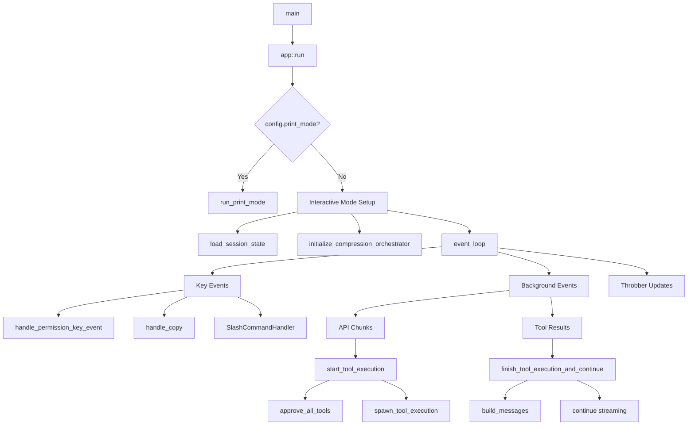

# Patina Call Graph Analysis

## Main Application Flow (app::run)



## Key Functions and Their Relationships

### 1. Entry Point Flow
- `main()` → `app::run()`
- Decision point: print mode vs interactive mode
- Configuration and state initialization

### 2. Interactive Mode Setup
- `initialize_compression_orchestrator()` - Sets up narsil integration
- `load_session_state()` - Restores previous session if requested
- `event_loop()` - Main interactive loop

### 3. Event Processing Architecture
- Key events: User input, navigation, clipboard operations
- Background events: API streaming, tool execution results
- Permission handling: Interactive approval system

### 4. Tool Execution Pipeline
- `start_tool_execution()` → `approve_all_tools()` → `spawn_tool_execution()`
- `finish_tool_execution_and_continue()` → API continuation
- Background task orchestration with channels

## Function Complexity Analysis
(What get_complexity would show)

**High Complexity Functions:**
- `event_loop()` - Large tokio::select! with multiple branches
- `run_print_mode()` - Complex tool execution loop
- `handle_permission_key_event()` - Multiple key mappings

**Medium Complexity Functions:**
- `initialize_compression_orchestrator()` - Conditional logic
- `load_session_state()` - Session resolution logic
- `format_tool_results_for_display()` - Content formatting

**Low Complexity Functions:**
- `handle_copy()` - Simple clipboard operation
- `auto_save_session()` - Straightforward save logic
```